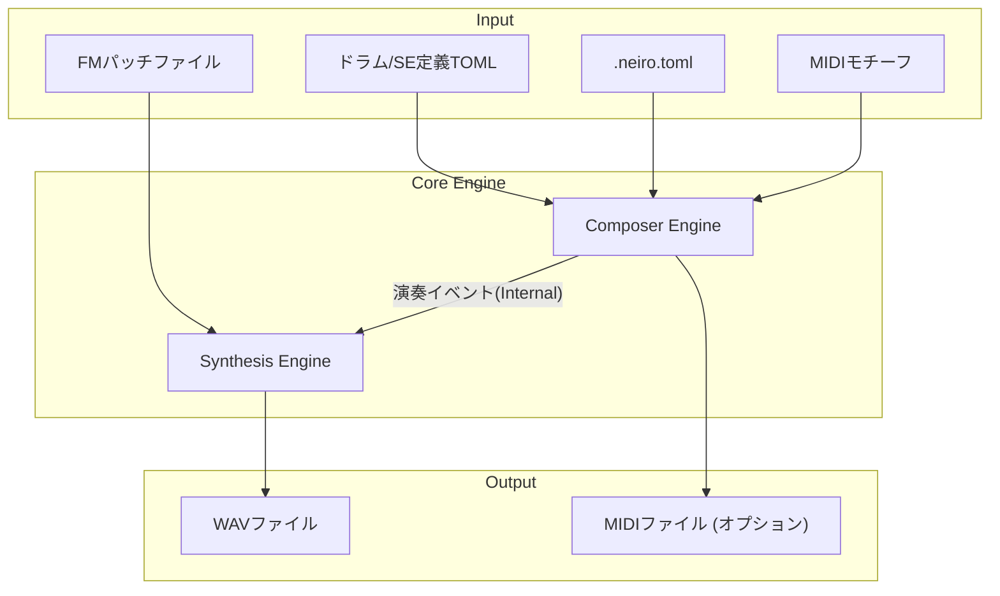

# neiro.rs 製品仕様書

## 1. 概要

`neiro.rs` は、16bit 時代の家庭用ゲーム機（主に Mega Drive / Genesis）に搭載されていた FM 音源の質感を再現し、BGM および効果音（SE）を自動生成する Rust 製のコマンドライン・インターフェース（CLI）ツールです。

本ツールは、インディーゲーム開発における「サウンドアセットの量産」と「プロトタイピングの迅速化」を主目的としています。人間が作成した短い旋律（モチーフ）を基に、ルールベースのアルゴリズムによって一曲の BGM へと展開する「モチーフ展開エンジン」としての性質を持ちます。

## 2. コンセプト

ツール名称の `neiro` は日本語の「音色（ねいろ）」に由来し、それを構成する「音（oto）」と「色（iro）」の二要素が、設計上の重要な切り分けとなっています。

- **音 (oto)**: 旋律、リズム、構成といった音楽的な構造。
- **色 (iro)**: FM パッチやエンベロープといった音響的な質感。

完全な AI による自動作曲ではなく、人間の創造的な判断（モチーフの作成）とツールの計算能力（変奏と展開）を組み合わせることで、実用性の高いサウンド生成を実現します。

## 3. システムアーキテクチャ

システムの全体像とデータの流れを以下に示します。

### 3.1. データフロー図



### 3.2. モジュール構成

- **`neiro-cli`**: ユーザー入力を受け取り、各エンジンを制御するフロントエンド。
- **`composer-engine`**: 音楽理論に基づき、モチーフから旋律や伴奏を生成する階層型エンジン。
- **`nuked-opn2` (Pure Rust Port)**: YM2612 (OPN2) の回路を再現した高精度なレンダリングエンジン。
- **`psg-engine`**: SN76489 の挙動をシミュレートする補助音源エンジン。
- **`asset-manager`**: パッチファイル（TFI/VGI/DMP）およびプロジェクト設定の管理。

## 4. ユーザーインターフェース

### 4.1. サブコマンド構成

```bash
neiro init                          # プロジェクトの初期化
neiro bgm  <options>                # BGMの生成
neiro se   <options>                # 効果音の生成
neiro iro  <subcommand>             # 音色（パッチ）の管理
neiro play <file.wav>               # 生成したWAVのプレビュー再生
```

### 4.2. 主要なコマンド引数（BGM）

| 引数 | 説明 | 備考 |
|---|---|---|
| `--scene <name>` | 生成する曲のシーン（battle, explore等）を指定 | 必須 |
| `--chord <str>` | コード進行の指定（例: "Am-F-C-G"） | 省略時は設定ファイルを参照 |
| `--motif <path>` | 種となる MIDI ファイルのパス | 省略時はシーン用フォルダからランダム選択 |
| `--seed <N>` | 乱数シード値 | 再現性の確保に利用 |
| `--loop` | ループ再生に適した波形を出力 | ターンアラウンドの自動生成を含む |
| `--fit-motif` | モちーフの音高をコード進行に強制適合させる | - |

## 5. データフォーマット定義

### 5.1. プロジェクト設定 (.neiro.toml)

```toml
[project]
default_out    = "out/"
sample_rate    = 44100

[scenes.battle]
chord          = "Am-F-C-G"
tempo          = 150
form_template  = "AABA"

[[form_templates]]
name     = "AABA"
sections = [
  { name = "A", bars = 8 },
  { name = "A", bars = 8 },
  { name = "B", bars = 8 },
  { name = "A", bars = 8 },
]
```

### 5.2. 効果音定義 (SE TOML)

```toml
patch_category = "hit"
duration_ms    = 120

[pitch_env]
start_offset = 0
end_offset   = -5
curve        = "exp_decay"
```

## 6. 音源仕様

### 6.1. 搭載音源チップ

- **YM2612 (OPN2) 相当**: 6チャンネル FM 音源。
    - Ch 1-5: FM 合成旋律・伴奏
    - Ch 6: DAC モードによるサンプリングドラム再生（将来対応）
- **SN76489 (PSG) 相当**: 3チャンネル矩形波 + 1チャンネルノイズ。
    - 補助旋律、アルペジオ装飾、ハイハット/スネアのノイズ成分に使用。

### 6.2. 対応パッチフォーマット
- TFM Music Maker (.tfi)
- VGM Music Maker (.vgi)
- DefleMask Patch (.dmp)

## 7. 生成アルゴリズムの詳細

BGM 生成は以下の 8 つの階層（L1-L8）を経て行われます。

1.  **L1: 形式テンプレート選択**: 曲の構成（AABA 等）と長さを決定します。
2.  **L2: モチーフ読み込み**: 指定またはランダムに選択された MIDI モチーフを解析します。
3.  **L3: ドラム生成**: リズムテンプレートに基づき、基本となるグルーヴを生成します。
4.  **L4: ベースライン生成**: コードのルート音とドラムのキックに同期したベースを生成します。
5.  **L5: モチーフ展開**: モチーフを反復、移調、断片化させることで旋律を展開します。
6.  **L6: ハーモニー生成**: 旋律に対する平行 3 度やコードパッドを生成します。
7.  **L7: チップチューン装飾**: 高速アルペジオやピッチスライド等の装飾を確率的に付与します。
8.  **L8: ヒューマナイズ**: 最小限の音量揺らぎを加え、機械的な印象を軽減します。

## 8. 非機能要件

- **ポータビリティ**: 外部の動的ライブラリに依存せず、各プラットフォームでシングルバイナリとして動作すること。
- **決定論的生成**: 同一の入力パラメータおよびシード値からは、常にバイナリレベルで同一の WAV ファイルが生成されること。
- **パフォーマンス**: 3 分程度の楽曲レンダリングを、一般的なデスクトップ PC 環境で 5 秒以内に完了させること。
- **音響精度**: `nuked-opn2` の Rust 移植版により、実機と遜色のないエイリアシングノイズやエンベロープ挙動を再現すること。

## 9. 開発ロードマップ

1.  **Phase 0: 音源コアの実装**: YM2612 の Rust 移植および PSG 実装の完了。
2.  **Phase 1: SE 生成エンジン**: パラメトリックな効果音生成機能の実装。
3.  **Phase 2: BGM 生成基礎**: モチーフ読み込みと単一セクションのループ生成。
4.  **Phase 3: 作曲エンジンの高度化**: 複数セクション構成（AABA 等）と変奏ロジックの実装。
5.  **Phase 4: 最適化と品質改善**: エフェクト処理の追加およびレンダリング速度の向上。

## 10. 用語集

- **オペレータ (Operator)**: FM 合成における最小の波形生成単位。
- **アルゴリズム (Algorithm)**: 複数のオペレータをどのようにつなぐかを示す接続構成。
- **モチーフ (Motif)**: 楽曲の核となる、1〜2 小節程度の短い印象的な旋律。
- **Bit-identical**: ビット単位で完全にデータが一致している状態。移植版の検証基準。
- **SSG-EG**: YM2612 特有の、減衰挙動を反復させたり保持したりする特殊なエンベロープ機能。
